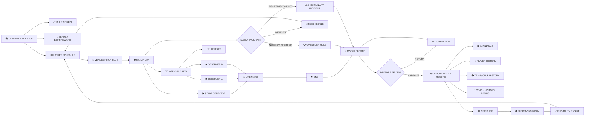

# PLAYPRO NEXT MAP — MATCH OPERATIONS CITY BLOCK

**Purpose:** next map after the match-control architecture. This is a design map, not implementation.

## City view

## Map rules

- Green path = normal match lifecycle.
- Yellow path = review/configuration/decision points.
- Red path = incident, sanction or blocked eligibility.
- Black path = external/administrative boundary.
- A match cannot become official merely because observers entered data.
- Referee approval is the officialization gate.
- Suspension/ban is a separate eligibility layer and feeds future fixture selection.
- Fixture scheduling must understand venue/pitch availability so four simultaneous pitches cannot collide.
- Competition configuration determines format-specific consequences.

## Next design boxes

1. Competition rule configuration — 17 areas.
2. Fixture scheduling and qualifying-fixture definition.
3. Venue → pitch → slot availability.
4. Official crew assignment.
5. Match start/end operator.
6. Observer event capture.
7. Match report versioning.
8. Referee review / correction loop.
9. Official match record lock.
10. Incident → sanction.
11. Suspension ledger → served-match calculation.
12. Ban status → eligibility block.
13. Appeal → PlayPro review.
14. Official record → player/team/coach history.

## Important design principle

The map follows the real-world football operation first. Database tables, RPC names and UI screens are implementation details that must be fitted to this flow during schema design, not allowed to dictate the business process.
