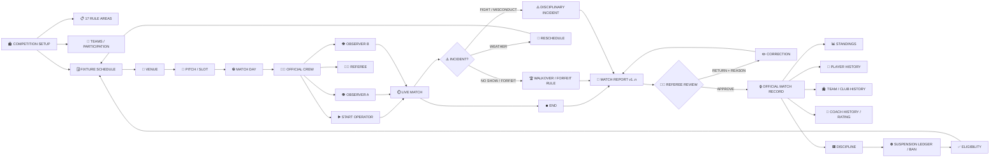

# PLAYPRO NEXT MAP — MATCH OPERATIONS CITY BLOCK

**Purpose:** executable city map for the next PlayPro architecture stage.
**Status:** SCHEMA DESIGN READY · no production DDL applied.

## 1. City view

## 2. City legend

- 🟢 normal operational route;
- 🟡 review/configuration/decision gate;
- 🔴 incident/sanction/ineligible route;
- ⚫ administrative/external boundary.

The map describes business flow first. Table names and RPC names are implementation details fitted to the flow.

## 3. What already exists in production

`playpro2` currently contains the core match objects required to anchor the design:

| City block | Live anchor | Current role |
|---|---|---|
| Fixture | `fixtures` | fixture, teams, date, venue text, referee reference, state, duration, group/bracket |
| Live observation | `match_events` | event/time/sequence, recorder, void/audit fields |
| Player match data | `player_match_stats` | appearance/statistics foundation |
| Playing time | `match_playing_time` | playing-time foundation |
| Participants | `match_participants` | match participation foundation |
| Official result | `match_results` | result + officiality/ratification gate |
| Standings | `standings` + existing trigger | downstream competition table |
| Suspension | `suspensions` | current suspension ledger foundation |
| Referee identity | `referees` | referee identity/profile foundation |
| Discipline | `disciplinary_records` | existing discipline foundation |

## 4. City blocks still requiring schema work

### 🟡 RULE DISTRICT
`competition_rule_config` is a design target. The 17 Phase-A rule areas must be represented at competition scope and versioned where historical decisions depend on them.

### 🟡 MATCH REPORT OFFICE
A versioned report layer is required between observation and referee approval. It must support `DRAFT → SUBMITTED → RETURNED → APPROVED` and preserve correction history.

### 🟡 OFFICIAL RECORD GATE
Use the existing `match_results.is_official`, `ratified_by`, `ratified_at`, `entered_by`. Do not create a parallel official-results table.

### 🟡 OFFICIAL CREW OFFICE
`referee_assignments` is the intended single source of truth for fixture officials. The existing `fixtures.referee_id` remains a compatibility/derivation item until schema review.

### 🔴 DISCIPLINE DISTRICT
Extend the existing `suspensions` foundation into the canonical ledger. Suspension service is based on qualifying official team fixtures, not player re-registration.

### 🔴 BAN DISTRICT
Incident → sanction → `BANNED` / `NOT ELIGIBLE` → selection block. Three months is configurable PlayPro policy, not universal FIFA law.

### 🟡 APPEAL OFFICE
Appeal request → RM100 fee → PlayPro review → `UPHOLD / MODIFY / REVOKE` → mandatory reason → auditable eligibility/sanction update.

### 🟡 VENUE DISTRICT
Model `VENUE → PITCH → SLOT → FIXTURE` so four pitches can operate concurrently without double booking.

## 5. Canonical match state machine

`SCHEDULED → CREW ASSIGNED → STARTED → LIVE → ENDED → REPORT SUBMITTED → REFEREE REVIEW`

From review:

- `RETURNED → CORRECTED → RESUBMITTED → REFEREE REVIEW`
- `APPROVED → OFFICIAL → LOCKED`

No observer-to-observer approval exists in this state machine.

## 6. Suspension city rule

For each active suspension the engine must determine:

`START FIXTURE → QUALIFYING TEAM FIXTURE #1 → #2 … → SERVED → COMPLETED → ELIGIBLE`

The suspended player does not have to appear in the squad for a qualifying fixture. The system evaluates the team's official fixture itself.

Therefore:

`REGISTERED ≠ ELIGIBLE`

## 7. Incident branches

- Weather/postponement: fixture is not falsely finalized; scheduling creates/manages the rescheduled fixture according to configured competition rules.
- No-show/forfeit: configured walkover/forfeit rule determines result and points.
- Fighting/misconduct: incident is attached to the match report/referee report; PlayPro disciplinary process determines sanction, ban and any configured competition consequence.
- If both teams are responsible, the configured competition rule determines result/replay/points and sanctions.

## 8. Implementation gate

The next technical sequence is fixed:

`PRODUCTION TRUTH → SCHEMA DESIGN → SCHEMA REVIEW → MIGRATION PLAN → OWNER APPROVAL → IMPLEMENTATION → TEST → DEPLOY`

This branch now contains the schema-design and migration-plan artifacts. Production DDL is deliberately not applied until the repository baseline and schema review gate are satisfied.
